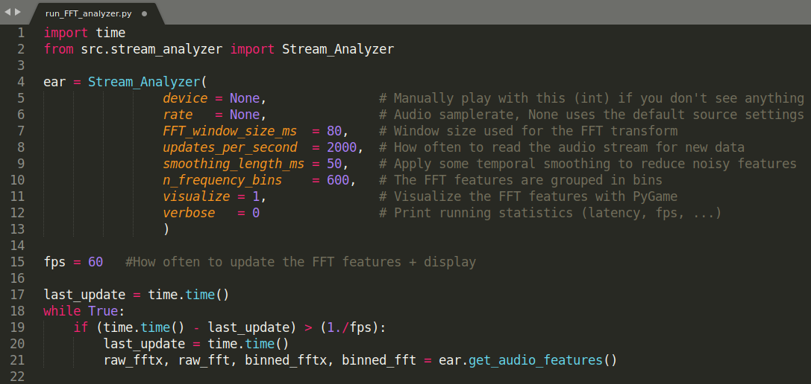

# Realtime_PyAudio_FFT

  

### A simple package to do realtime audio analysis in native Python, using PyAudio and Numpy to extract and visualize FFT features from a live audio stream.

**The basic pipeline:**
* Starts a stream_reader that pulls live audio data from any source using PyAudio (soundcard, microphone, ...)
* Reads data from this stream many times per second (eg 1000 updates per second) and stores that data in a fifo buffer
* When triggered by `.get_audio_features()`, the stream_analyzer, applies a Fast-Fourier-Transform to the most recent audio window in the buffer
* When `visualize` is enabled, the visualizer displays these FFT features in realtime using a PyGame GUI (I made two display modes: 2D and 3D)

**Usage:**
* I have personally learned **A LOT** about sound by watching this realtime visualization while listening to music
* You can run the stream_analyzer in headless mode and use the FFT features in any Python Application that requires live musical features

**Requirements:**
I developped this code on my local machine, it has not been properly tested on other setups..
If something doesn't work, please try to fix it yourself and post an issue if needed!
* Tested on Ubuntu 18.04
* Other platforms like Mac/Windows should work if PyGame can find your display (can be tricky with WSL)

Tested with:
* Python 3.6.3
* pygame  --> Version: 1.9.6
* pyaudio --> Version: 0.2.11
* scipy   --> Version: 1.4.1

**ToDo:**
* Implement realtime beat detection / melody extraction on top of FFT features (eg using Harmonic/Percussive decomposition)
* The pygame.transform operations sometimes cause weird visual artifacts (boxes) for some resolution settings --> fix?
